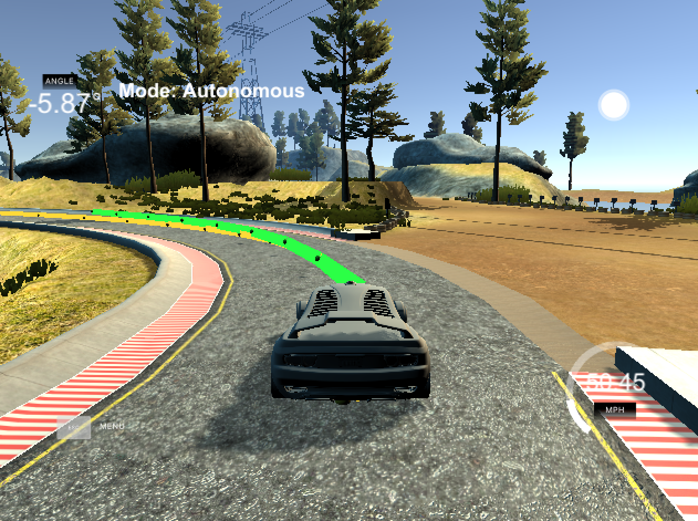
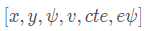
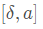

#**Model Predictive Control** 

##Writeup by Max Ritter

In this project, a Model Predictive Control (MPC) algorithm is implemented to control the actuators of a car and drive it around a simulated track. 

This control algorithm is far more advanced than a classic PID controller, because it can look N timesteps in the future by using the physical model and also use a lot of constraints for accurate steering and acceleration control. 

Additionally, there's a 100 millisecond latency between actuations commands on top of the connection latency to account for real-time delay in actuations.

### The model

This project uses a kinematic bycicle model originally described in [this paper](http://www.me.berkeley.edu/~frborrel/pdfpub/IV_KinematicMPC_jason.pdf). Kinematic models are simplifications of dynamic models that ignore tire forces, gravity, and mass. At low and moderate speeds, kinematic models often approximate the actual vehicle dynamics.

The state of the vehicle can be represented as `x-position`, `y-position`, orientation `psi` and the velocity `v`. In addition to that, we also include the two errors `CTE` (cross-track-eror) and `epsi` (orientation error) into the  state vector:

We can control the state of the vehicle over two actuators. `Delta` controls the steering angle, whereas `alpha` is used for acceleration (throttle & brake):

Concerning the actuators, constraints have to be made. First, the vehicle can't move in arbitrary directions. Therefore, the steering angle is limited to +- 25 degrees. Second, the gas and braking should be in defined boundaries. In our case, we use -1 for maximum brake, and +1 for maximum gas.

Our kinematic model can be described by the following equations. They take into account the state & actuator variables, the timestep dt, and the distance between the front of the vehicle and its center of gravity Lf:

### Timestep Length and Elapsed Duration

A value of 10 for the number for the timestep length N seems to be an optimal tradeoff between computational complexity and the ability to look ahead far enough. Slightly smaller (8) and larger (up to 15) values should also work well.

For the elapsed duration dt, I chose a dt of 0.1s (100ms). Higher values might not work well, because the environment might change too fast for the controller to give accurate results. A lower value drives computational costs unnecessarily high and therefore makes no sense for this simulation. I also changed the maximium CPU time for the IpOpt optimizer to 100ms, so it will deliver a result in this maximum time barrier.

The total calculated time can be calculated by N multiplied by dt, which gives a value of one second. This means that MPC predicts the set of states for the next second. When the car is driving at high speed, this seems like a good value. Of course, in real-environments, it could make sense to increase N to get a higher timeframe for prediction.

### Polynomial Fitting and MPC Preprocessing

The waypoints for the reference trajectory line are transformed to the car's perspective first. This makes all the following computations much easier. The waypoints are now centered around the car's x- and y-position and the orientation angle is zero. 

Afterwards, the method `polyfit` is used to fit those transformed waypoints to a 3rd order polynomial function. Given the coefficients and the x values, `polyeval` calculates the y positions. With several of those points, the yellow reference trajectory line is drawn inside the simulator.

### Model Predictive Control with Latency

When applying the inputs to the actuators, there is a so called latency, which results from the time the actuators need to apply the commands. In this project, a time delay of 100ms (implemented as sleep in the main function) should take care of this. 

After trying several methods, I found a simple solution to account for the latency: My MPC returns a sum of the actuations for the next timestep and the following timestep afterwards. This way, the model applies also the next actuations and therefore handles the latency of 100ms. The described method is the case for both the steering angle `delta` and the acceleration `alpha`.
